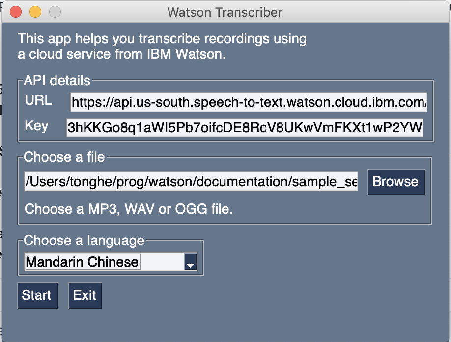
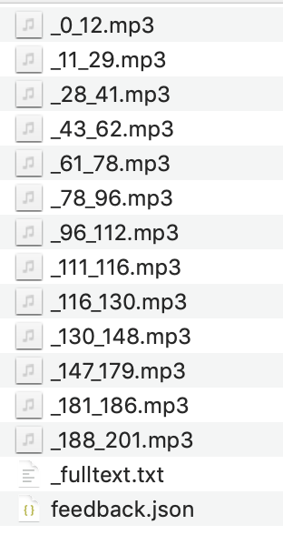
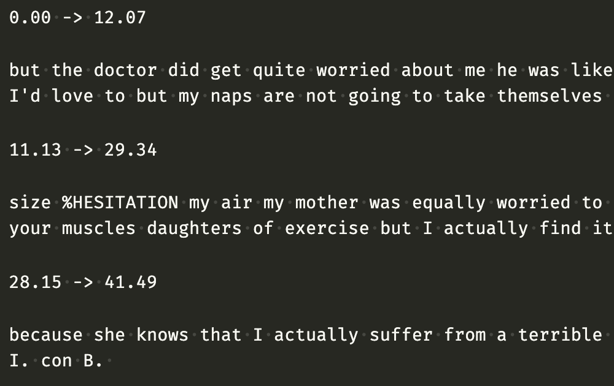

# Let IBM Watson Transcribe Your Audio Recordings

## What it does

When you have all the presrequisites and credentials ready (see below), it's as simple as it looks:

1. Choose a recording in either MP3, WAV or OGG format;
2. Choose a language. Supported languages include Arabic, German, English (Australia, UK, US), Spanish (Argentina, Spain, Chile, Colombia, Mexico, Peru), French (Canada, France), Italian, Japanese, Korean, Dutch, Portuguese (Brazil) and Chinese (Mandarin).
3. Click `Start` and wait a few minutes, depending on how large your recording file is.
4. You'll get a bunch of `.mp3` files. These are the segments of your original recording, cut and named according to time stamps, that loosely corresponds to sentences.

5. You'll also get a file called `_fulltext.txt` which looks like this. Time stamps of the beginning and end of each segment, followed by the words spoken during that segment. 

## How you can use it

**These other programs and packages are needed**

This program runs on Python 3, so you first need to have `Python 3` installed. You also need these packages. If you don't have them already, you can pretty much install them using `pip`. Just note the package name of `PySimpleGUI` is all lowercase.

* [PySimpleGUI](https://pysimplegui.readthedocs.io/en/latest/) (`pip3 install pysimplegui`)
* [pydub](https://github.com/jiaaro/pydub)
* [requests](https://requests.readthedocs.io/en/master/)

If the above is ready, download `transcriber.py` to your computer. Got to the directory where you've saved this program, run it using `python3 transcriber.py`.

**You also need to have an account of IBM Cloud**

If you don't, you can [register here](https://cloud.ibm.com/registration). (I'm *not* affiliated with IBM in any way.) You get 500 hours of transcription time for free each month. 

If you already have an account, you'll be able to fetch your `API Key` and `URL`. These are *not* your login and password. Log in to IBM Cloud and go to “Resource list” (just click [this link](https://cloud.ibm.com/resources)), you should see `Speech to Text-y2` under the `Services` rubric.

Click on it and then “view full details”. Now you can download the credentials as shown in the image below. Put the credentials file (`ibm-credentials.env`) in the same folder as this program. (You can also manually copy and paste the `API Key` and `URL` somewhere. And manually paste into the program later.)

## Samples

I transcribed two sample recordings using this program. The resulting full text and segments of audio are found in the [the documentation folder](/documentation/).

The English sample (`sample_en.mp3`) is a section from [a performance](https://www.youtube.com/watch?v=avDfmV5RAfQ) by Aisling Bea. For lack of an Irish English option, I chose English (UK) for this recording. The Chinese sample (`sample_zh.mp3`) is a section from the latest episode of the pop culture podcast [Loud Murmurs](https://loudmurmurs.buzzsprout.com/). 

Sections of the transcriptions are shown below, with error highlighted.

**English (Ireland)**

but the doctor did get quite worried about me he was like <s>actually</s><strong>Aisling</strong> you're going to have to get out of the house during the day and I was like doc I'd love to but my naps are not going to take themselves 

<s>size %HESITATION my air</s><strong></strong> my mother was equally worried <s>to</s><strong>she was</strong> like <s>actually</s><strong>Aisling</strong> <strong>you should</strong> <s>trying</s><strong>try and get</strong> out of the house <s>I need to</s><strong>and maybe</strong> do some exercise build up your strength in your muscles <s>daughters</s><strong>do a bit</strong> of exercise but I actually find it highly offensive that my mother would suggest that I do exercise 

**Chinese (Mandarin)**

对但是同样这部动画片当时是呃就是国内观众看了和美国当时的小朋友一起看的时候大家的反响都是非常好的因为他们有真正的去研究泛亚裔的文化并且它的 <s>利益</s><strong>立意</strong> 是没有局限于这些条条框框比如说 <s>昂然</s><strong>honor</strong> 就一定是哎呀我要为家族复仇 <s>者</s><strong>怎么</strong> 怎么样这个电影它还有一些电影之外的一些矛盾就是跟它的这个时机有关系<s>让偷你</s><strong>就像 Tony</strong> 刚才说的他筹拍到他基本上快拍完那个时代和现在其实短短两三年之内可以说很多东西都天翻地覆现在木兰很多争议就是木兰他怎么这个 <s>条款</s><strong>条框</strong> 违反的不对啊什么什么的其实
